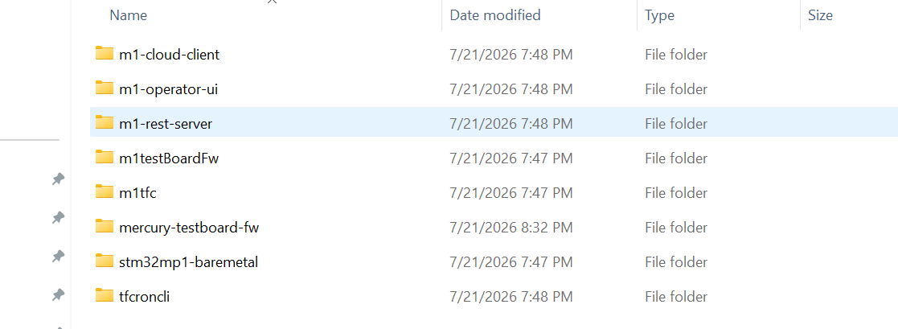
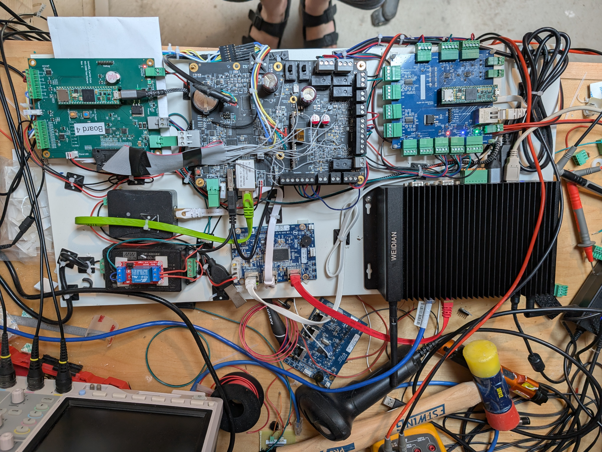

**EVM Platform Overview**

*Unified Engineering, Validation and Manufacturing Platform*

Version 1.0 \| July 25, 2026\
Owner: Leo Buchman\
Status: Initial controlled draft

  -------------------------------------------------------------------------------------------
  Document Type                       Platform Overview
  ----------------------------------- -------------------------------------------------------
  Platform                            M1/MNPlus EVM

  Scope                               Hardware / architecture

  Source Baseline                     Schematics, platform diagram, physical configurations
  -------------------------------------------------------------------------------------------

# 1. Purpose

The M1/MNPlus EVM is a reusable platform that supports engineering development, hardware-in-the-loop validation, QA, manufacturing, provisioning, recovery, failure analysis, and technical support. The production fixture is one deployment of the platform; the underlying architecture is broader than a product-specific tester.

# 2. Platform Outcomes

- Common engineering and production infrastructure

- Repeatable hardware, firmware, and software validation

- Serial, USB, Ethernet, RS-485, OSDP, Wiegand, and PoE test access

- Programming, provisioning, recovery, and regeneration

- Reusable M1 and ACM simulation subsystems

- Cloud-connected updates, diagnostics, logs, secrets, and remote support

# 3. System Architecture

{width="7.0in" height="2.563115704286964in"}

*Figure 1 - EVM platform architecture (current system-level view)*

# 4. Major Subsystems

  ---------------------------------------------------------------------------------------------------------------------------------------------------
  **Subsystem**                       **Primary responsibility**
  ----------------------------------- ---------------------------------------------------------------------------------------------------------------
  Headless PC                         React operator UI, REST control services, Node.js test execution, cloud and recovery services

  M1 Test Board                       M1-scope control, programming, recovery, measurements, boot selection, and product interface

  ACM Controller Test Board       ACM/ACM simulation: readers, supervised inputs, relay/output validation, tamper and power-fault functions

  SAM-E Ethernet Subsystem            Local three-port Ethernet switching for test and PoE paths

  Power / PoE Subsystem               12.5 V and 5 V fixture rails plus switched 48 V PoE delivery

  Product Interface                   Direct IDC/terminal-block engineering access or product-specific production plate and pogo-pin mapping
  ---------------------------------------------------------------------------------------------------------------------------------------------------

# 5. Supported Lifecycle Uses

  -------------------------------------------------------------------------------------------------------------------
  **Lifecycle phase**                 **Representative uses**
  ----------------------------------- -------------------------------------------------------------------------------
  Engineering                         Bring-up, firmware/software development, debug, direct signal access

  QA / Validation                     Automated regression, HIL, serial and Ethernet testing

  Manufacturing                       Programming, provisioning, configuration, qualification, pass/fail validation

  Sustaining / Support                Recovery, regeneration, failure analysis, diagnostics, remote assistance
  -------------------------------------------------------------------------------------------------------------------

# 6. Engineering and Production Deployments

The platform uses the same core architecture in two physical configurations. The engineering configuration favors direct access and flexibility. The production configuration favors repeatability, speed, and operator simplicity.

{width="6.8in" height="5.119922353455818in"}

*Figure 2 - Engineering bench configuration with direct terminal-block and board access*

{width="6.8in" height="9.03138779527559in"}

*Figure 3 - Production fixture implementation with enclosed electronics and mechanical UUT interface*

# 7. Product Coverage

- M1 controller platform

- MNPlus platform, including the M1 and ACM functional scopes

- ACM controller families

- ACM door controllers

- ACM I/O expansion boards

- Elements end-to-end validation workflows

# 8. Document Map

- Platform Capabilities

- Hardware Architecture

- Engineering vs Production Configurations

- M1 Test Board Hardware Specification

- ACM Controller Test Board Hardware Specification

- Factory Production Fixture Assembly Guide

- Twenty-Year Sustainment Plan
