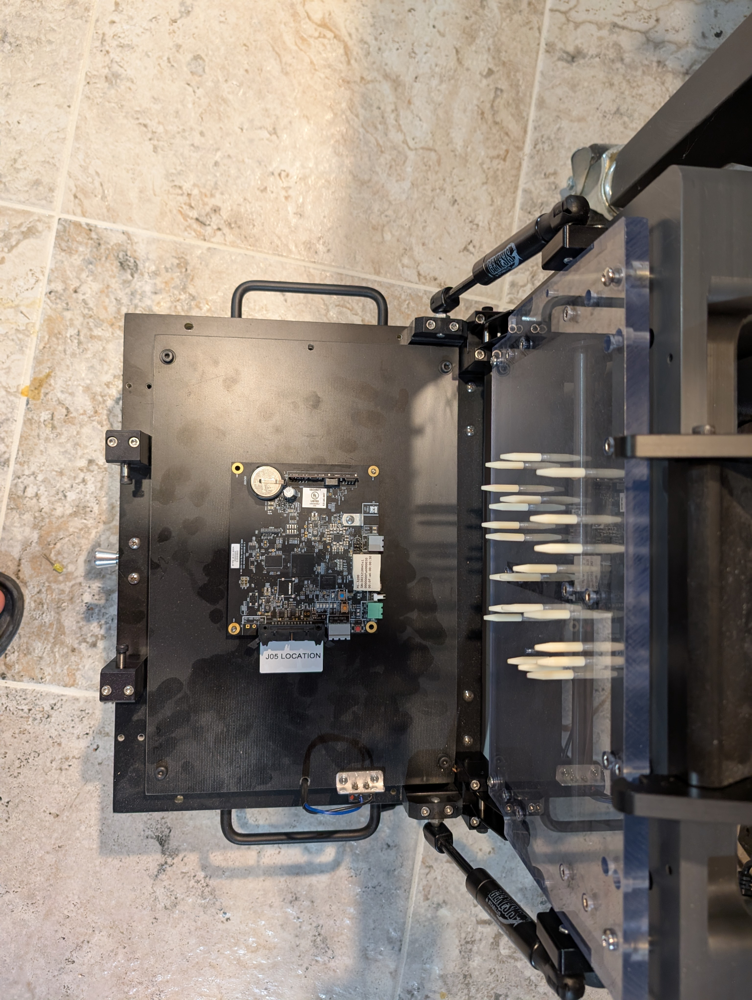
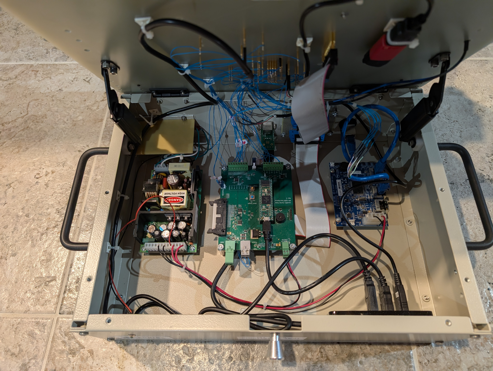

**Engineering vs Production Configurations**

*Two deployments of the same EVM architecture*

Version 1.0 \| July 25, 2026\
Owner: Leo Buchman\
Status: Initial controlled draft

  -------------------------------------------------------------------------------------------
  Document Type                       Configuration Description
  ----------------------------------- -------------------------------------------------------
  Platform                            M1/MNPlus EVM

  Scope                               Hardware / architecture

  Source Baseline                     Schematics, platform diagram, physical configurations
  -------------------------------------------------------------------------------------------

# 1. Core Principle

The engineering bench and production fixture are not different products. Both use the same platform architecture and differ primarily in interface, mechanics, wiring, access, and workflow.

# 2. Engineering Bench Configuration

{width="6.8in" height="5.119922353455818in"}

*Figure 1 - Engineering bench configuration*

- Open assembly with direct board visibility

- Terminal blocks for signal access

- Direct IDC connection where appropriate

- No production enclosure required

- Supports development, bring-up, experimentation, debug, and failure analysis

- Prioritizes flexibility and signal visibility

# 3. Production Fixture Configuration

{width="6.8in" height="9.03138779527559in"}

*Figure 2 - Production mechanical fixture and product nest*

{width="6.8in" height="5.119922353455818in"}

*Figure 3 - Production fixture electronics and wiring*

- Enclosed electronics and controlled mechanical assembly

- Product-specific plate and pogo-pin map

- Lever-actuated repeatable engagement

- Operator status indication

- Automated programming, provisioning, and validation

- Prioritizes repeatability, throughput, safety, and simple operation

# 4. Product-Specific Variants

  -----------------------------------------------------------------------------------
  **Item**                        **M1**                      **MNPlus**
  ------------------------------- --------------------------- -----------------------
  Core EVM electronics            Common                      Common

  M1 Test Board                   Used                        Used for M1 scope

  ACM Controller Test Board   As required by test scope   Used for ACM scope

  Fixture plate                   M1-specific                 MNPlus-specific

  Pogo-pin map                    M1-specific                 MNPlus-specific

  Wiring                          Product-specific            Product-specific
  -----------------------------------------------------------------------------------

# 5. Configuration Control

- Each production plate requires a controlled drawing and revision

- Pogo-pin maps must be versioned

- Harness/wiring drawings must identify the supported UUT revision

- Engineering direct-connect configurations should document IDC pinout and bench wiring

- Factory Acceptance Test must reference the exact configuration baseline
