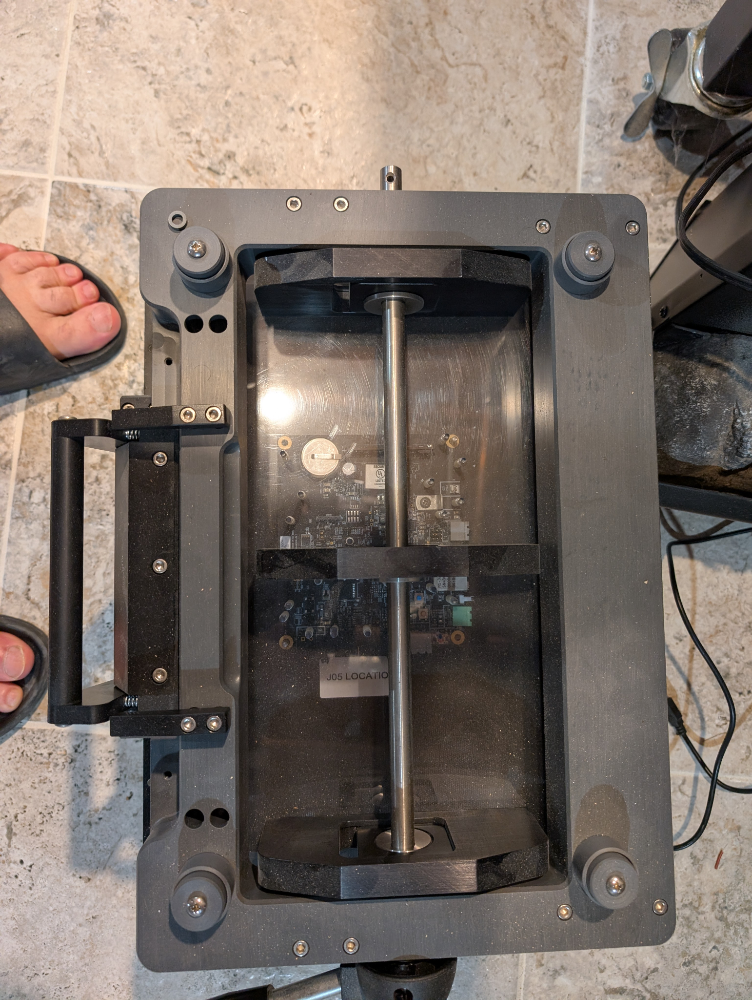

**Production Fixture Assembly Guide**

*Initial factory build and verification baseline*

Version 1.0 \| July 25, 2026\
Owner: Leo Buchman\
Status: Initial controlled draft

  -------------------------------------------------------------------------------------------
  Document Type                       Factory Assembly Guide
  ----------------------------------- -------------------------------------------------------
  Platform                            M1/MNPlus EVM

  Scope                               Hardware / architecture

  Source Baseline                     Schematics, platform diagram, physical configurations
  -------------------------------------------------------------------------------------------

# 1. Purpose and Status

This initial guide records the known production-fixture architecture and the factory-document package required to build the enclosure and assemble the platform. Exact part numbers, wire lengths, torque values, connector tables, and controlled CAD drawings must be inserted from released manufacturing sources before the guide is used as a production work instruction.

# 2. Assembly Overview

{width="6.8in" height="9.03138779527559in"}

*Figure 1 - Completed production fixture example*

# 3. Major Assemblies

- Enclosure and back-panel interfaces

- Mechanical lever and UUT retention structure

- Product-specific fixture plate

- Pogo-pin bed and wiring interface

- M1 Test Board

- Mercury Controller Test Board

- SAM-E Ethernet switch

- PoE injector

- 12.5 V / 5 V power supply

- 48 V power supply and relay

- USB hub

- Fanless PC

- Operator lever switch and status LED

- Internal harnesses and terminal blocks

# 4. Required Controlled Inputs

  ---------------------------------------------------------------------------------------------------
  **Artifact**                        **Status in this draft**
  ----------------------------------- ---------------------------------------------------------------
  Released BOM                        Required - not yet supplied

  Enclosure/mechanical drawings       Required - CAD available from Leo

  Plate drawing and pogo map          Required for each UUT variant

  Harness drawings                    Required - not yet supplied

  Power wiring diagram                Architecture known; production detail required

  Board source packages               Schematics available; complete manufacturing package required

  PC image and configuration          Separate software/operations document required

  Factory Acceptance Test             Initial checklist below; detailed limits required
  ---------------------------------------------------------------------------------------------------

# 5. Recommended Assembly Sequence

1\. Inspect enclosure and mechanical parts

2\. Install power supplies, protected mains wiring, and grounding

3\. Install terminal blocks, relay, PoE injector, USB hub, and SAM-E switch

4\. Install M1 and Mercury test boards on approved standoffs

5\. Install fanless PC and network/USB connections

6\. Install product-specific plate and pogo-pin assembly

7\. Route and secure internal wiring using controlled harness drawings

8\. Verify continuity, polarity, grounding, and insulation

9\. Apply power without a UUT and verify all unloaded rails

10\. Load approved PC image and board firmware

11\. Run Factory Acceptance Test with the approved golden UUT

12\. Record serial number, configuration, and release results

# 6. Initial Factory Acceptance Checklist

- Visual inspection complete

- Protective earth / chassis ground verified

- 12.5 V rail verified

- 5 V SAM-E rail verified

- 48 V rail and relay control verified

- USB devices enumerated

- Ethernet communication established

- M1 Test Board self-test passed

- Mercury Controller Test Board self-test passed

- Pogo-pin continuity/contact verified

- Golden UUT programming and recovery verified

- Serial testing passed

- Ethernet/PoE testing passed

- Operator lever and status indication passed

- Results and configuration recorded

# 7. Safety Hold Point

This draft must not replace released electrical-safety and manufacturing work instructions. Mains wiring, protection, fusing, grounding, and enclosure requirements require formal review and approval.
