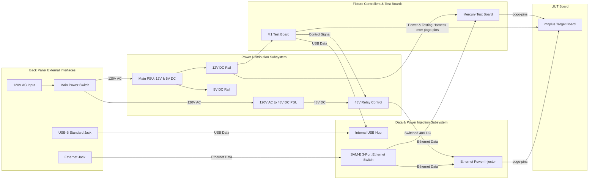

# mnplus Fixture Electrical and Operation Diagram

## Scope
This document models the mnplus fixture primary AC/DC power distribution, M1 test board controller integration, Mercury test board integration, back-panel interface routing, secondary PoE power/data path, and pogo pin contact reliability rules.

## Electrical Block Diagram

## Notes & Design Guidelines

### Architectural Notes
- Back-panel USB-B jack routes internally to the internal USB Hub.
- M1 Test Board is wired to the internal USB Hub.
- Back-panel Ethernet jack routes internally to the SAM-E 3-port Ethernet switch.
- SAM-E Ethernet switch outputs connect to:
  - Ethernet Power Injector
  - Mercury Test Board (via Ethernet cable)
- SAM-E Ethernet output and 48V DC (relay-switched) feed the Ethernet power injector.
- Combined PoE output routes directly through pogo pins to the UUT board.
- **M1 Test Board**:
  - Powered by 12V DC rail from the main PSU.
  - Wired to the internal USB Hub.
  - Generates control signal to actuate the 48V PoE relay.
  - Connects to UUT via testing harness over pogo pins to supply board power, perform interface tests, and measure voltage test-points.
- **Mercury Test Board**:
  - Powered by 12V DC rail from the main PSU.
  - Connected via Ethernet cable to the SAM-E Ethernet switch.
  - Wired to UUT via pogo pins.

### Pogo Pin Contact Reliability Guidelines
- **Fixed Hard-Stop Compression**: Ensures consistent pogo pin travel and prevents over-compression damage.
- **Distributed Hold-Down**: Prevents PCB flexing under spring force.
- **Contact Resistance**: Minimizes contact resistance variation for accurate voltage/current measurements.

