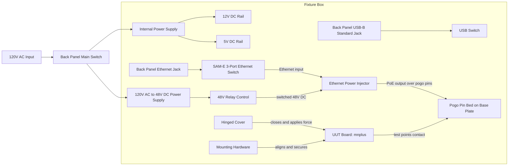
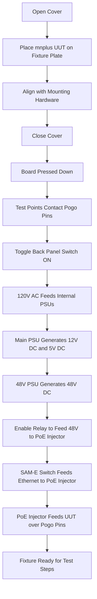

# mnplus Fixture Electrical and Operation Diagram

## Scope
This diagram captures the fixture mechanics and primary power flow described so far.

## Electrical Block Diagram

## Operation Sequence Diagram

## Notes
- This version models only the elements provided so far.
- Back panel includes an Ethernet jack and USB-B standard jack.
- USB-B jack routes to an internal USB switch.
- Ethernet jack routes to an internal SAM-E 3-port Ethernet switch.
- PoE injector receives Ethernet from the SAM-E switch and switched 48V DC through a relay.
- PoE injector output goes to the UUT through pogo-pin connections.
- Next revision can add controller, signal routing, measurements, and pass/fail indication.
