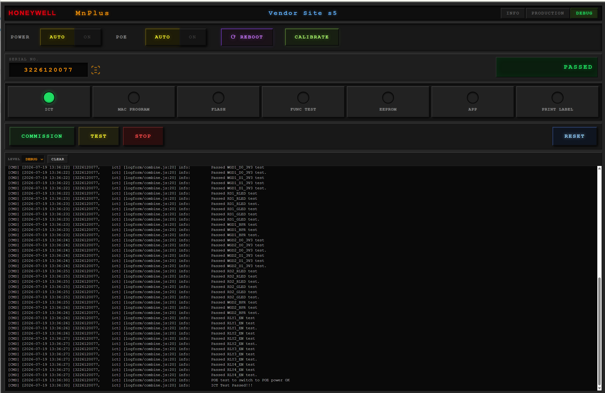

# M1 Operator UI Guide

This guide covers normal operator use of the React-based M1 production test panel. It does not replace fixture loading, board handling, or site-specific safety procedures.

## Before You Start

1. Confirm that the fixture PC, REST service, M1 test fixture, and UUT are ready according to the site procedure.
2. Load the UUT in the fixture and establish the required fixture contact before starting a run.
3. Confirm the M1TFC REST service is reachable. The UI normally connects to `http://<fixture-pc>:3300`; development defaults to port `3300` on the current host.
4. Have the 10-digit board serial number available. The UI accepts digits only and will reject any other length.

The fixture label shown in the title bar comes from the REST server configuration. Select **INFO** to view the UI, React, Snap, and expected firmware versions. Those values are expected-state information; hardware-read firmware verification remains part of the fixture procedure.

## Choose A Mode

The panel starts locked. Select **PRODUCTION** or **DEBUG** and enter the authorized PIN when prompted.

**Production mode** is the normal manufacturing path.

- Power and PoE controls are held in automatic mode.
- The log panel shows failure information rather than the full log.
- A serial number that just completed a fully passing production run cannot be run again until a different serial is entered.

**Debug mode** is for authorized fixture diagnosis.

- The full log is visible, with `INFO`, `DEBUG`, and `TRACE` detail levels.
- Individual test steps can be selected directly.
- Power, PoE, reboot, and ICT calibration controls are available.
- Moving from production to debug requires re-authentication before a later return to production.

The UI locks after 90 minutes without input. It reconnects to the log stream after the operator unlocks it again.

## Run A Board

1. Enter or scan the **SERIAL NO.**. It must contain exactly 10 digits.
2. Select **COMMISSION** for the normal full sequence, or **TEST** for a re-test.
3. Watch the overall status and the individual step indicators. The current step is yellow; completed steps turn green; a failed or stopped step turns red.
4. Wait for **PASSED**, **FAILED**, or **STOPPED** before removing the UUT or starting another action.

The full commissioning sequence is:

1. ICT
2. MAC PROGRAM
3. FLASH
4. FUNC TEST
5. EEPROM
6. APP
7. PRINT LABEL

A re-test runs the same order but skips **FLASH**. ICT uses the existing cell-battery tolerance during a re-test; a full commissioning run uses the new-board tolerance path.

The run stops at the first failed step. If a step other than **PRINT LABEL** fails, the UI attempts to print an error label. After every fully passing sequence, it sends the fixture `cleanup` command and records the serial as passed for the current UI session.

## Interpret Results

- **READY**: no active run and no final result yet.
- **RUNNING**: a command or sequence is in progress.
- **PASSED**: every selected sequence step passed.
- **FAILED**: a command failed, the serial was invalid, or the serial was blocked because it already passed in production mode.
- **STOPPED**: the operator stopped the active command.

In debug mode, a failed run displays a failure summary above the log. In production mode, the log area is titled **FAILED TESTS** and suppresses normal progress lines.

Use **CLEAR** to clear the server log and the displayed log lines. Use **RESET** to clear the UI result, progress, indicators, and failure summary; it does not run a fixture cleanup command or clear the server log.

## Debug Controls

Use these controls only under the applicable engineering or fixture procedure:

- Select an individual step indicator to run that command by itself.
- **POWER** and **POE** send the corresponding fixture command; **AUTO** sets the local UI state to automatic and sends the off command to the fixture.
- **REBOOT** asks for confirmation before sending the target reboot command.
- **CALIBRATE** asks for confirmation, then runs ICT with `--calibrate true`.
- **STOP** asks for confirmation, requests `/command/stop`, and aborts the browser-side active command stream.

Calibration changes persistent test-board data under `/etc/m1platform/calibration.json`. It must be performed only on the correct fixture and with a successful persistent write, not merely a successful displayed result. Verify every calibrated voltage with a meter. Use the approved Golden Board as the reference for the expected voltage values; do not accept calibration solely from software-reported measurements.

## Logs And Connectivity

After unlock, the UI loads the most recent 120 log lines, then listens to the REST server's Server-Sent Events log stream. The displayed history is limited to the most recent 500 lines.

A disconnected or reconnecting log indicator means the log stream is unavailable; it does not by itself prove a fixture test has stopped. Check the current command status, REST service health, fixture connections, and saved logs before deciding the test result.

Use the browser's downloaded debug log only as a local operator copy. The fixture log configured by the REST service remains the production record.

## Communication Summary

| UI Function | REST Interface |
| --- | --- |
| Read fixture label and expected version fields | `GET /config` |
| Start normal or debug command | `POST /command/stream` |
| Stop active streamed command | `POST /command/stop` |
| Read recent log history | `GET /logs/tail?lines=120` |
| Receive live log lines | `GET /logs/stream?lines=1` via Server-Sent Events |
| Clear server log | `POST /logs/clear` |
| Authenticate or change mode PIN | `POST /auth` |
| Change a mode PIN | `POST /changepin` |

The REST server serializes fixture commands so that concurrent UI actions do not contend for the same hardware interfaces.
